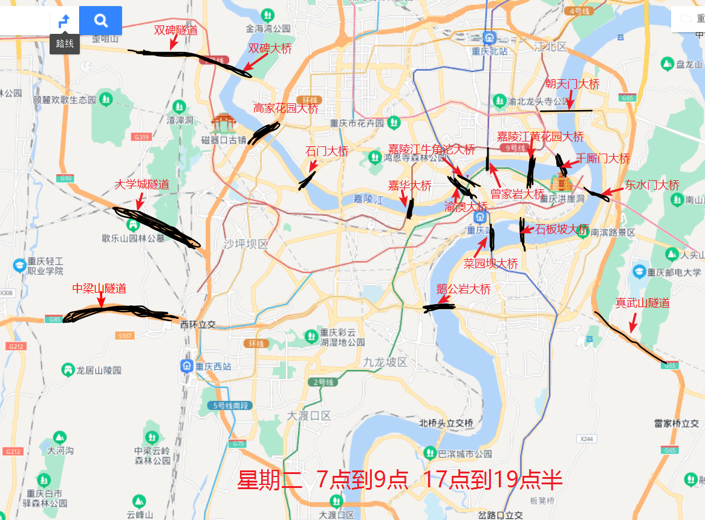

# 重庆限行规则

### 限行实施时间

2022年3月1日-2023年2月28日

### 限行车辆

所有渝籍和非渝籍号牌汽车

### 限行时段

工作日的早高峰7点—9点和晚高峰17点—19点半时段，每日共4.5小时。

### 尾号限行规则

在工作日按汽车号牌（含临时号牌）最后一位阿拉伯数字对应，对应规则为：

星期一：1和6 错峰通行时段和错峰通行范围禁止通行；

星期二：2和7 错峰通行时段和错峰通行范围禁止通行；

星期三：3和8 错峰通行时段和错峰通行范围禁止通行；

星期四：4和9 错峰通行时段和错峰通行范围禁止通行；

星期五：5和0 错峰通行时段和错峰通行范围禁止通行。

### 限行区域范围

​		重庆市：高家花园大桥、高家花园大桥复线桥、石门大桥（双向）、嘉华大桥（双向）、渝澳大桥、牛角沱嘉陵江大桥、黄花园大桥（双向）、千厮门大桥（双向）、朝天门大桥（双向）、东水门大桥（双向）、石板坡长江大桥、石板坡长江大桥复线桥、菜园坝大桥（双向）、鹅公岩大桥（双向）、曾家岩大桥（双向）、双碑大桥（双向）、真武山隧道（双向）、双碑隧道（双向）、大学城隧道（双向）、中梁山隧道（双向）

### 限行处罚

对当日违反错峰通行规定的车辆，由公安交通管理部门按照道路交通安全法有关规定依法查处，罚100元、记3分